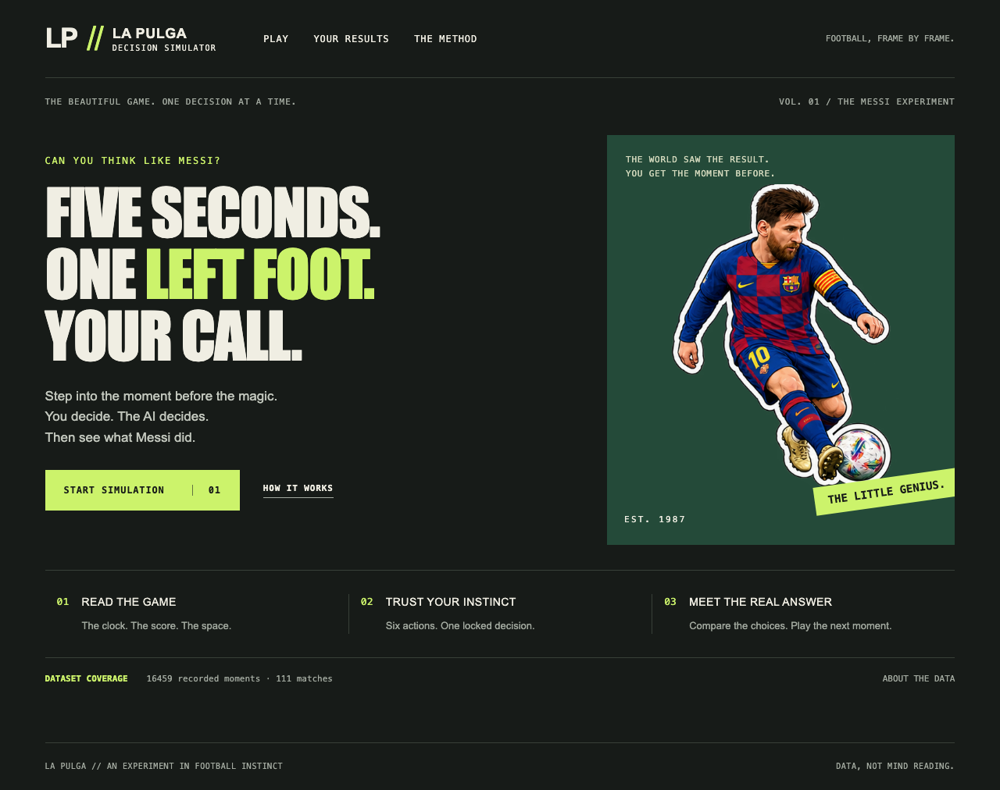
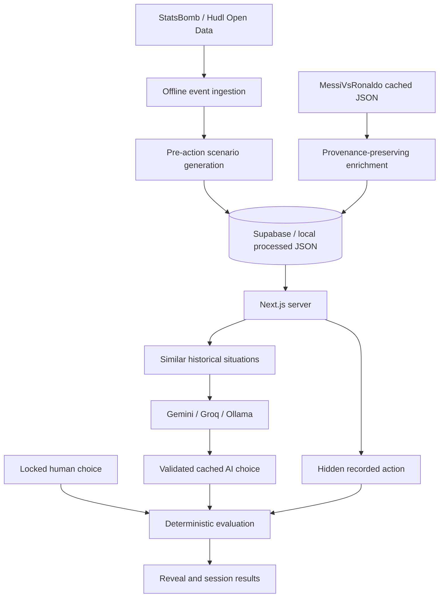

# LA PULGA // Decision Simulator

**Can an AI reproduce Messi’s recorded football decisions? Can you do better?**

A small football game built around the instant before an action: read the pitch, lock your choice, let an independent agent decide, then reveal and compare. This is a decision-similarity experiment, not a chatbot or a claim to reproduce Messi’s mind.

## Run locally

Use Node.js 22 or newer (the installed Supabase client requires native WebSocket support).

```sh
nvm use
npm install
cp .env.example .env.local
npm run dev
```

Open http://localhost:3000. No credentials are needed for fixture mode. The six bundled fixtures are explicitly **synthetic training reconstructions**, not historical records. No mock AI is presented as an LLM. Without a configured provider, play Human vs Messi.

## Product

- `/`: short game menu
- `/play`: SVG pitch, six actions, optional target, locked reveal
- `/results`: device-local results, action/era/season/zone breakdowns
- `/methodology`: coverage, sources, scoring matrix, limitations



[Mobile game menu](docs/screenshots/home-mobile.png) · [Desktop simulator](docs/screenshots/play-desktop.png)

## Visual design

A vintage match-programme palette pairs warm paper and oxblood with a petrol pitch and gold markers. Anton and Barlow Condensed are self-hosted under the SIL Open Font License (included in `public/fonts`). The interface uses explicit SVG controls, keyboard-visible focus, active navigation, sticker entrances and reveal transitions; reduced-motion settings disable animation.

## Architecture

Next.js App Router + strict TypeScript, server components/actions, Tailwind CSS, Zod, Supabase PostgreSQL, and Vitest. No standalone backend or workers.



## Scoring

A fixed symmetric action matrix is in `lib/evaluation/score.ts`. MDSS weights: action 50%, target 30%, era 10%, intent 10%. Missing terms are excluded and weights renormalized. Intent is unavailable in V1 and never guessed. Era compatibility requires at least five matching scenarios. Target similarity awards 60% for matching the longitudinal third, 40% for matching the lateral lane. Exact action matching is separate.

The SVG uses 120 × 80 StatsBomb coordinates. Distances use an assumed 105 × 68 metre pitch. No unknown players are invented. Predicted paths end at a zone centre, not a model-generated precise destination.

## Hidden-answer boundary

`buildPublicScenario()` uses a nested allowlist. Raw events, current-event qualifiers, next events, recorded target and outcome never cross that boundary. The AI does not see the human’s answer. Similarity retrieval excludes the current match entirely. Season profiles are explicitly retrospective context.

## Artwork

`public/stickers/` contains the supplied transparent PNG sheets. Cropped SVG views preserve the original artwork for the landing page, era panels, match context and thinking/completion states. Missing files fall back to a number-10 badge. `PitchScene` separates football state from the SVG renderer so future sprites or a 3D renderer need not change the domain model.

## Sources and limits

- [StatsBomb Open Data, now maintained at hudl/open-data](https://github.com/hudl/open-data): event ground truth. Verified the original repository redirects here. Respect the repository licence and attribution conditions; published data analysis must credit StatsBomb and use its provided logo.
- [MessiVsRonaldo.app](https://www.messivsronaldo.app/): optional match/season context only. No unverified event inference and no runtime scraping.

Open data covers selected matches, not Messi’s whole career. An event stream is not tracking data. Unknown defenders, passing lanes, orientations, and pressure geometry remain unknown. Era boundaries are editorial. An LLM may recall historical matches from training; this is not a blind cognitive benchmark. MDSS measures recorded-action similarity, not tactical optimality.

## Validation

```sh
npm test
npm run typecheck
npm run build
```

## Roadmap (not V1)

Custom era sprites; animation; optional React Three Fiber renderer; StatsBomb 360; richer spatial states; other players and a Ronaldo agent; manager agents; expected threat; model tournaments; human leaderboards; multiplayer challenge links.

## Data pipeline

Run Phase 1 fixtures before downloading data. The fixture vertical slice was validated on desktop Chromium and mobile WebKit before the real ingestion path was added.

```sh
npm run data:download                         # All available matches in the three configured eras
npm run data:inspect
npm run data:ingest
npm run scenarios:generate
```

Default download covers Argentina at the **2022 World Cup**, Barcelona **2018/2019 La Liga**, and Barcelona **2010/2011 + 2011/2012 La Liga**. The three simulator panels filter these exact team/season combinations and show actual match and scenario counts. `2010–12` means the two seasons starting in 2010 and 2011, not every calendar-year match through 2012. Coverage is limited to the official open dataset, not all competitions or Messi's full career.

Verified local coverage:

| Selection                         | Matches | Scenarios |
| --------------------------------- | ------: | --------: |
| Argentina 2022 World Cup          |       7 |       830 |
| Barcelona 2018/19 La Liga         |      34 |     4,383 |
| Barcelona 2010/11–2011/12 La Liga |      70 |    11,246 |
| Total                             |     111 |    16,459 |

The downloader defaults to all available matches in these periods. `--limit` is optional and applies per competition-season. Imports store validated events in individual match files plus a small manifest, avoiding a single huge multi-season JSON file.

Select other available competitions/seasons using IDs from `data/raw/competitions.json`:

```sh
npm run data:download -- --competition 11 --season 27 --limit 3
```

The downloader caches competition indexes, match indexes, lineups and events; checks Messi's lineup presence; and makes sequential, paced requests. Existing cache files are reused. Ingestion validates schemas and preserves raw events. Scenario IDs are deterministic. Goal events update the score only after the pre-action scenario is captured. Shootouts are excluded. Coordinates are already normalized by StatsBomb and are not flipped again at halftime.

Pass mapping: `cross=true` takes precedence → CROSS; otherwise a pass ending at least five units behind its start → RECYCLE; other passes → PASS. Carry/Dribble/Shot map directly. Unsupported events are skipped. No dribble destination is invented. Previous context only includes earlier events from the same possession, period, and team coordinate frame.

`data/raw`, `data/processed`, and `data/enrichment` are gitignored. Do not commit full match event files. The server loads precomputed scenarios and caches the loaded dataset for 60 seconds; restart after ingestion for immediate refresh. It does no runtime downloading or scenario generation.

## Supabase setup

1. Create a Supabase project.
2. Execute `supabase/migrations/001_initial.sql` in its SQL editor (or use Supabase CLI migrations).
3. Set all Supabase values in `.env.local`.
4. Run `npm run data:sync` after local ingestion and scenario generation.
5. Restart Next.js.

The migration creates tables only; it does not import match data. Run `npm run data:sync` with Node.js 22+ to populate them. For an interrupted upload of the same unchanged local dataset, use `npm run data:sync -- --resume`; it checks remote event counts and skips fully uploaded matches. Use the normal command to overwrite corrected source data. Uploads use bounded batches, retry transient errors, and report progress.

Sync is idempotent through deterministic IDs and upserts. It uploads competitions, teams, players, matches, events, scenarios, and available enrichment. All tables use RLS; anonymous and authenticated database clients have **no direct privileges**. Next.js uses the server-only service-role client. Never create a public SELECT policy on scenarios, events, runs, or rounds: they contain answers.

`round_sessions` supports atomic first-choice locking across serverless instances. `user_attempts` is anonymous and unique per round. Agent calls are claimed atomically and cached under `(scenario_id, provider, model, prompt_version)`. A stale in-flight claim can be reclaimed after one minute. Prompt version includes a hash of the safe context, historical frequencies, and enrichment so stale context does not reuse a misleading answer.

Without Supabase, the simulator uses local processed JSON (or synthetic fixtures), process-local round locks, and a local disk AI cache. Restarting the server expires local rounds. Browser-local results survive reloads on that device; they are not a trusted leaderboard. With Supabase configured but no imported scenarios, the app shows clearly labeled fixtures rather than assuming the database is populated.

## Environment reference

| Variable                    | Purpose                                                                           |
| --------------------------- | --------------------------------------------------------------------------------- |
| `SUPABASE_URL`              | Supabase project URL                                                              |
| `SUPABASE_SERVICE_ROLE_KEY` | Server-only database access                                                       |
| `LLM_PROVIDER`              | `gemini` (default), `groq`, or `ollama`                                           |
| `GEMINI_API_KEY`            | Server-only Gemini key                                                            |
| `GROQ_API_KEY`              | Server-only Groq key                                                              |
| `GEMINI_MODEL`              | Default `gemini-3.5-flash-lite`                                                   |
| `GROQ_MODEL`                | Default `openai/gpt-oss-20b`                                                      |
| `OLLAMA_BASE_URL`           | Default `http://localhost:11434`; configured by the operator, never request input |
| `OLLAMA_MODEL`              | Installed local model name; required for Ollama mode                              |

Environment is validated through Zod at Next.js startup. All secret-bearing modules import `server-only`. Missing provider credentials enable human-only play; malformed configured values fail startup. Provider requests time out, validate JSON with Zod, and never expose raw errors or keys to the browser.

## LLM setup

For Gemini, create a key in [Google AI Studio](https://aistudio.google.com/) and set `GEMINI_API_KEY`. The selected default has a documented [free tier](https://ai.google.dev/gemini-api/docs/pricing); availability and limits are account-dependent. The model is configurable. Older Gemini 2.5 models are restricted for new projects, per the [model catalog](https://ai.google.dev/gemini-api/docs/models).

For Groq, set `LLM_PROVIDER=groq` and `GROQ_API_KEY`. The default is listed in [Groq's model catalog](https://console.groq.com/docs/models). Set an alternative model available to your account; no paid plan is required by the application itself.

For Ollama, install and start Ollama, pull a model that supports structured JSON output, set `LLM_PROVIDER=ollama`, and set `OLLAMA_MODEL` to its exact local name. Ollama on your laptop is not reachable from a Vercel function at `localhost`; use local hosting for local inference.

All providers receive the same grounded prompt. There is no simulated LLM response. Cached validated decisions are reused; provider failure leaves Human vs Messi available. Fixture decisions never enter a historical Supabase scenario cache.

## Enrichment import

```sh
npm run enrichment:import -- --file /absolute/path/to/import.json
npm run data:sync # optional, when Supabase is configured
```

See [the adapter format and source-handling notes](services/messivsronaldo/README.md). Identical imports are idempotent; conflicting values and their provenance remain separate. Scalar database metric columns are filled only when a source has one distinct value; ambiguous values remain in metadata. Match statistics are never included in decision prompts. Per-90 tendencies are derived only with known positive minutes.

The local working dataset includes four manually verified [2022 Argentina all-international totals](https://www.messivsronaldo.app/international-stats/2022/): appearances, minutes, goals, and assists. Each field includes its source, source URL, definition (including friendlies), and retrieval date. These are retrospective context, not the answer to an event. No unverified dribbling, shooting, xG, or ratings are invented.

## Deploy to Vercel

Use the standard Next.js preset and the committed lockfile (`npm ci`, `npm run build`). Configure Supabase and one optional provider in the Vercel environment settings, apply the migration, and sync the local dataset before deployment. Because `/data` is intentionally ignored, **Supabase is required for durable real-data deployment**; a fresh checkout without it serves fixtures. Use free-tier project quotas and cached decisions. No Redis, background workers, or paid vector database are needed.

Webpack is selected in npm scripts because Turbopack's CSS worker failed to bind a port in the development environment. Both are supported Next.js build paths. The installed release is pinned in `package-lock.json`.

## Verification details

`npm test` covers parsing, Messi detection, attack direction, geometry, action mapping, pre-goal score state, future-event exclusion, nested answer leakage, deterministic scores, enrichment conflicts, provider envelopes/failures, caching, and round locking. Embedded PostgreSQL tests execute the actual migration and verify RLS privileges and atomic functions; this is a dev-only test dependency, not runtime infrastructure.

```sh
npx playwright install chromium webkit
npm run dev
npm run test:e2e
```

Browser tests exercise desktop and mobile selection → locking → reveal → results and check for horizontal overflow and uncaught page errors. Live Gemini/Groq/Ollama requests and remote Supabase synchronization require operator credentials; mocked provider contract tests and embedded PostgreSQL tests do not claim to replace that live validation.
